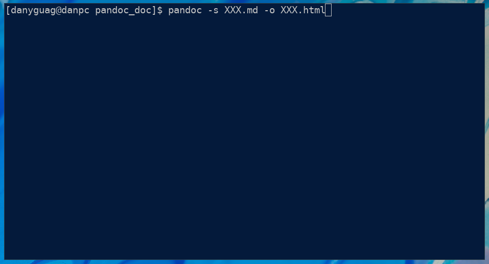
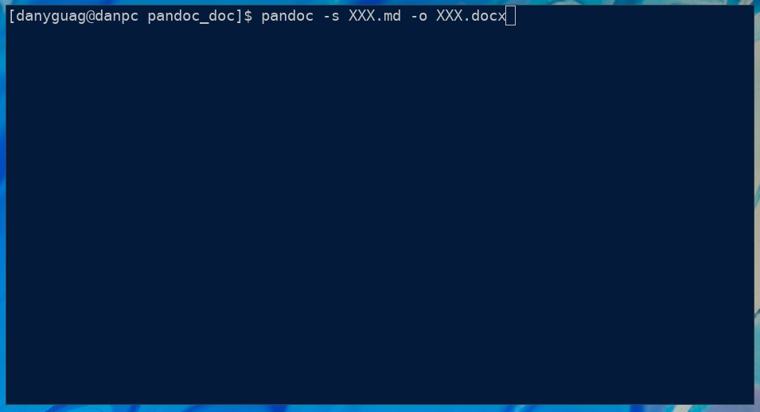
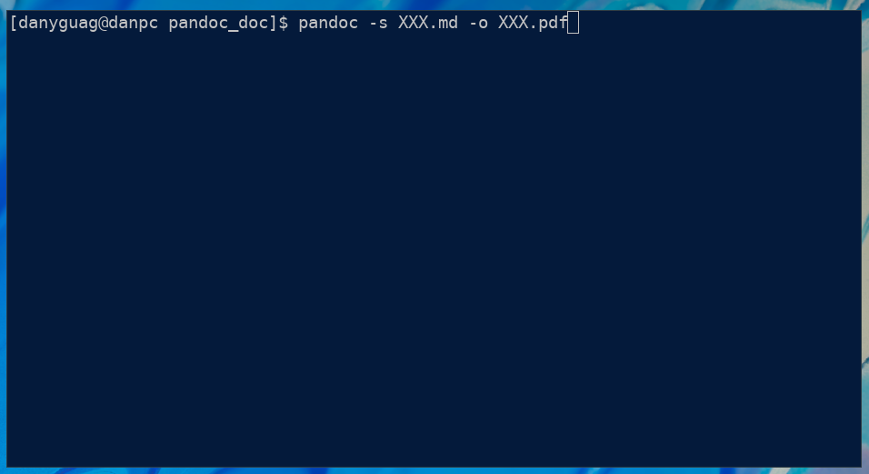

# How to Publish to EPUB, HTML, Word, and PDF

This assumes that the reader knows how to open a terminal on their computer.  This guide will show you how to convert Markdown files to ePub, HTML, Word, and PDF files. In each code block the `#` is a comment line likely referring to view a figure.

## Requirements

- Have a Terminal or Command Prompt installed
  > **NOTE:** No installation is needed, most operating systems have one by default.

## How to Navigate to a Content Directory

1. **Open** up your preferred Terminal or Command Prompt.

2. **Use** the `cd` command with the argument being a path to change directories (Refer to the command below).

	```sh
	# Refer to Figure 1 for the result of a successful change of directory command.
	cd projects/pandoc_doc/
	```

	<figure>
	
	<figcaption>Figure 1: An example cd command and resultant path change</figcaption>
	</figure>

## How to Publish to EPUB
#### Before you begin make sure to follow the guide navigate to your content directory.

1. **Type** the following command into your terminal.

	```sh
	# Refer to Figure 2 for the result of a succesful pandoc command.
	pandoc -s XXX.md -o XXX.epub
	```

	<figure>
	
	<figcaption>Figure 2: An incomplete pandoc command to generate EPUB</figcaption>
	</figure>

3. **Replace** the two `XXX`s in the command with the name of the markdown follow.

4. **Press** enter to convert the file.

## How to Publish to HTML
#### Before you begin make sure to follow the guide navigate to your content directory.

1. **Type** the following command into your terminal.

	```sh
	# Refer to Figure 3 for the result of a succesful pandoc command.
	pandoc -s XXX.md -o XXX.html
	```

	<figure>
	
	<figcaption>Figure 3: An incomplete pandoc command to generate EPUB</figcaption>
	</figure>

3. **Replace** the two `XXX`s in the command with the name of the markdown follow.

4. **Press** enter to convert the file.

## How to Publish to Word
#### Before you begin make sure to follow the guide navigate to your content directory.

1. **Type** the following command into your terminal.

	```sh
	# Refer to Figure 4 for the result of a succesful pandoc command.
	pandoc -s XXX.md -o XXX.docx
	```

	<figure>
	
	<figcaption>Figure 4: An incomplete pandoc command to generate EPUB</figcaption>
	</figure>

3. **Replace** the two `XXX`s in the command with the name of the markdown follow.

4. **Press** enter to convert the file.

## How to Publish to PDF
#### Before you begin make sure to follow the guide navigate to your content directory.

1. **Type** the following command from Figure 5 into your terminal.

	```sh
	# Refer to Figure 5 for the result of a succesful pandoc command.
	pandoc -s XXX.md -o XXX.pdf
	```
	
	<figure>
	
	<figcaption>Figure 5: An incomplete pandoc command to generate EPUB</figcaption>
	</figure>

3. **Replace** the two `XXX`s in the command with the name of the markdown follow.

4. **Press** enter to convert the file.

_________

Back to [main page](index.md)
