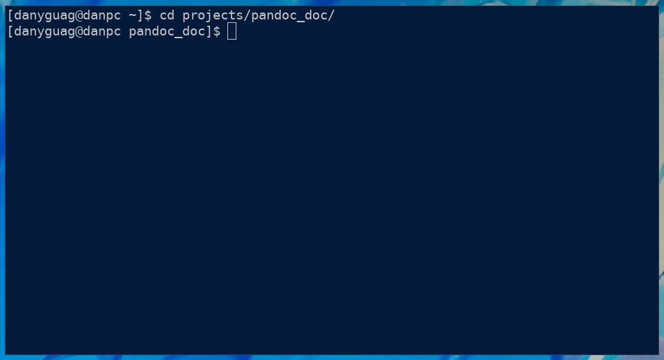
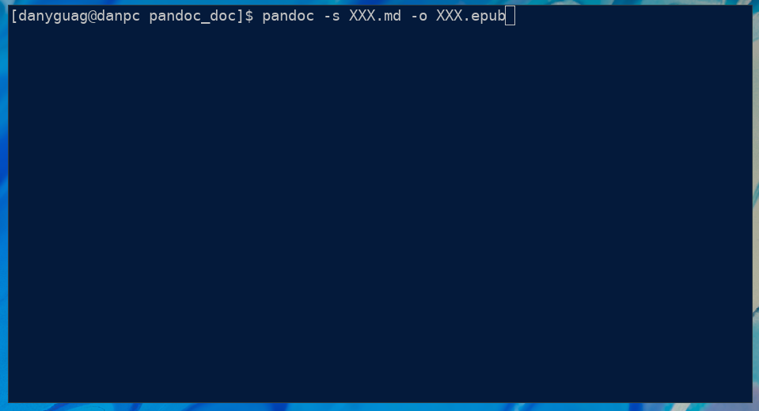

# How to Publish to EPUB, HTML, Word, and PDF

This assumes that the reader knows how to open a terminal on their computer.  This guide will show you how to convert Markdown files to ePub, HTML, Word, and PDF files. 

## Requirements

- Terminal (Refer to Figure 1)

## Navigating to Content Directory

1. Open up your preferred Terminal or Command Prompt.
2. Use the `cd` command with the argument being a path to change directories (Refer to Figure 1 for an example).
   <figure>
   
   <figcaption>Figure 1: An example `cd` command and resultant path change</figcaption>
   </figure>

## How to Publish to EPUB

1. Follow [Navigating to Content Directory](Navigating to Content Directory) or skip if you have already done so.
2. Copy the following command into your terminal.
   <figure>
   
   <figcaption>Figure 1: An incomplete pandoc command to generate EPUB</figcaption>
   </figure>
3. Replaced the two `XXX`s in the command with the name of the markdown follow.
4. Press enter to convert the file.
