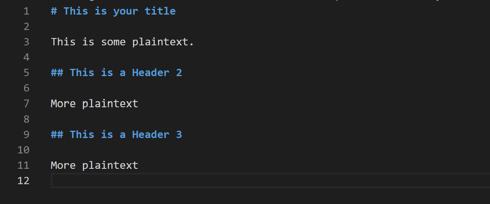

# How to Write in Markdown for Pandoc

This document will walk you through how to write a markdown file that can be used with Pandoc.

## Tools

- A text editor (I reccomend VS Code)
- Pandoc

## Steps

1. Create a new markdown file
    **Note:** Make sure that your filename ends with .md
2. Put a title at the top of the document
    1. To show that this is a header in markdown, put a "#" at the beginning of the line
    2. Type your heading
    3. Be sure to leave a blank space after the header
3. Add any subheadings that you want before different sections in you document
    1. Put two or three "#" characters at the beginning of the line, to indicate heading 2 or heading 3
    2. Type your heading
    3. Surround each heading with a blank line
4. Type any plain text you want in the position on the document where you want it to show up

Figure 1 shows an example of a markdown file created using these specifications

<figure>

<figcaption>Figure 1: A Markdown File</figcaption>
</figure>

You should now have written a markdown document that is properly formatted to be converted to other file formats using Pandoc
