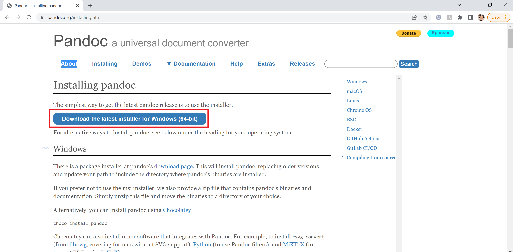
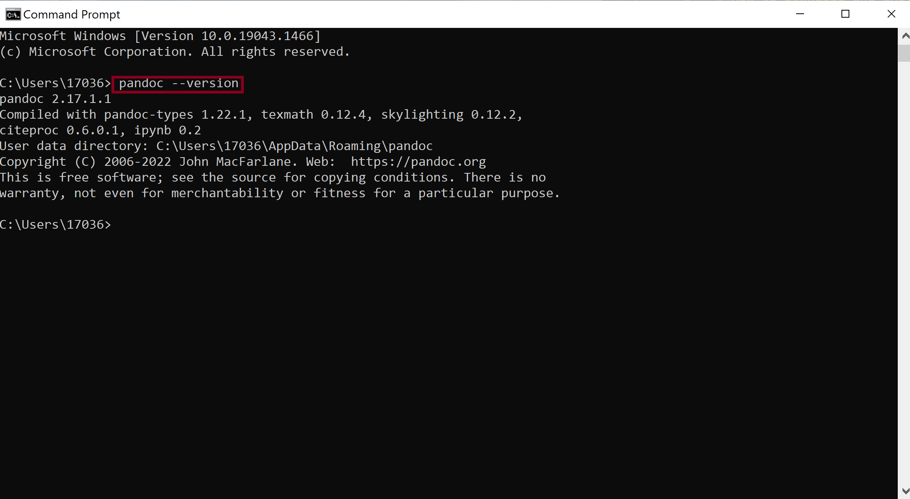
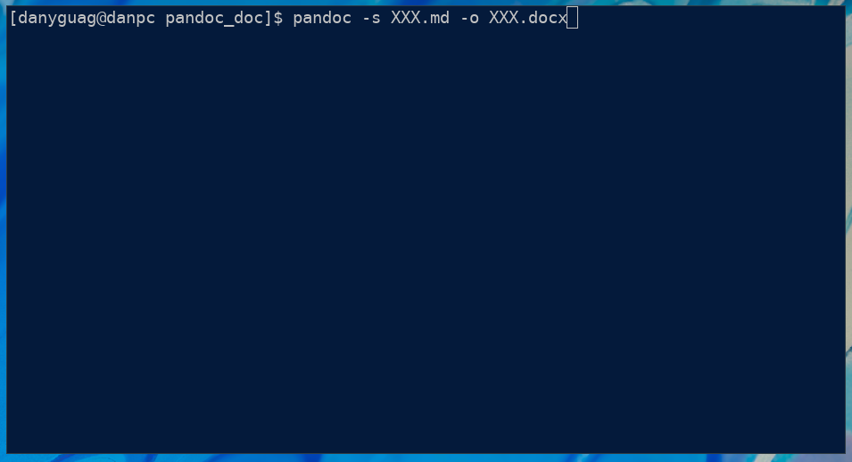

# Pandoc Documentation for ENGL 3814

As a student in ENGL 3814, you will need to work with Pandoc for many of your assignments. To those unfamiliar with Pandoc, the tool may be hard to use. This documentation should provide the information needed to use Pandoc successfully in this course.

## Tools

* Computer/Laptop
* Web Browser
* Commnad-Line interface (such as Terminal/Command Prompt)
* Text Editor (VS Code is recommended)
* Pandoc

## Table of Contents

* [What is Pandoc](pandoc_documentation.md/#what-is-pandoc)
* [How to Download and Install Pandoc](pandoc_documentation.md/#how-to-download-and-install-pandoc)
* [How to Set Up a Writing and Publishing Environment](pandoc_documentation.md/#how-to-set-up-a-writing-and-publishing-environment)
* [How to Write in Markdown for Pandoc](pandoc_documentation.md/#how-to-write-in-markdown-for-pandoc)
* [How to Publish to EPUB, HTML, Word, and PDF](pandoc_documentation.md/#how-to-publish-to-epub-html-word-and-pdf)

## What is Pandoc

[Pandoc](https://pandoc.org/index.html) is a content conversion tool created by [John MacFarlane](https://johnmacfarlane.net/).  This free and open source tool can be used by anyone to convert content to different forms of presentation.  Pandoc can be used to convert lightweight markup formats to more complex file types like HTML, Microsoft PowerPoint, PDF, and many more.  For a complete list of what you can convert your files to please check out [this](https://pandoc.org/index.html) list.  Pandoc must be invoked by a terminal. Here is an example command that one could use to convert Markdown files to Microsoft Word documents: `pandoc -s mymarkdowncontent.md -o mywordcontent.docx`.  It is also important to note that after every file conversion you should check the converted file for any mistakes because Pandoc is not perfect.

## How to Download and Install Pandoc

This section of the guide will teach you how to download and install Pandoc onto your laptop or computer.

### Tools and Requirements

* Preferred web browser

	> **NOTE:** Google Chrome will be used in this guide.
* Computer or laptop with a functioning operating system (such as Windows or macOS)

	> **NOTE:** Microsoft Windows will be used in this guide.

### Steps

Before you start the process of converting your Word document into a Markdown file, you first need to install Pandoc onto your laptop or computer!

1. **Open** your web browswer.

2. **Type** [pandoc.org/installing.html](pandoc.org/installing.html) into the address bar.

3. **Click** the blue "Download the latest installer for Windows (64-bit) button under the "Installing pandoc" section (Refer to Figure 1).

    > **NOTE:** Download the correct installer according to your operating system.

	
4. **Verify** that Pandoc has been successfully installed onto your computer or laptop. **Type** "Command Prompt" in the search bar next to the Windows icon on the bottom of your screen.
  
    >  **NOTE:** This step will be different depending on your operating system.

5. **Click** the "Command Prompt" app to open the Command Prompt window (Refer to Figure 2).

	

6. Once the Command Prompt is open, you should see a blinking cursor. **Type** the following text where the blinking cursor is.
  
    > pandoc \-\-version

7. **Press** enter. You should see a message telling you which version of Pandoc has been installed and other information (Refer to Figure 3).

	

## How to Set Up a Writing and Publishing Environment

Once you have Pandoc installed, you may now begin setting up your working enivronment. Going into this, you should know how to navigate your file explorer and create files.

### Tools

* Visual Studio Code (VS Code, see Figure 4)
  

    *(Figure 4)*

### Steps

1. **Open** your file explorer
2. **Navigate** to the folder you want to work in
3. **Create** a new folder for your project files.

    > NOTE: You might have already created this type of folder. If so, you do not need to create a new one.
4. **Open** VS Code
5. **Open** your project folder in VS Code
    * **Click** `File`
    * **Click** `Open Folder...`
    * **Navigate** to your project folder
    * **Select** your folder
    * **Click** `Select Folder`
6. **Right-click** the "Explorer" section on the left side of the window (see the square on Figure 5)
7. **Click** `New File` (see the circle on Figure 5)

    
        *(Figure 5)*
8. **Name** your new Markdown file

    > NOTE: The naming convention is usually follows this format -> "relevant-lowercase-file-name-without-spaces.md"
9. **Start** working on your Markdown file.

You have now set up your writing/publishing environment! **DON'T FORGET** to save your progress as you work.

## How to Write in Markdown for Pandoc

This document will walk you through how to write a markdown file that can be used with Pandoc.

### Tools

* A text editor (I reccomend VS Code)
* Pandoc

### Steps

1. Create a new markdown file

   > **Note:** Make sure that your filename ends with .md

2. Put a title at the top of the document

   1. To show that this is a header in markdown, put a "#" at the beginning of the line
   2. Type your heading
   3. Be sure to leave a blank space after the header

3. Add any subheadings that you want before different sections in you document

   1. Put two or three "#" characters at the beginning of the line, to indicate heading 2 or heading 3
   2. Type your heading
   3. Surround each heading with a blank line

4. Type any plain text you want in the position on the document where you want it to show up
   * Put two asterisks on both sides of any text you want to be bold
   * Surround any text that you want to be itallicized with asterisks

5. Create any numbered lists that you want to include
   1. Put "1." In front of every line in the list
   2. Include a blank line after the list

6. Create any bulleted lists that you want to include
   1. Put a "-" character at the beginning of every line in the list
   2. Include a blank line after this list

Figure 6 shows an example of a markdown file created using these specifications


	*Figure 6: A Markdown File*

You should now have written a markdown document that is properly formatted to be converted to other file formats using Pandoc.
	
## How to Publish to EPUB, HTML, Word, and PDF

This assumes that the reader knows how to open a terminal on their computer.  This guide will show you how to convert Markdown files to ePub, HTML, Word, and PDF files. In each code block the `#` is a comment line likely referring to view a figure.

### Requirements

* Have a Terminal or Command Prompt installed
  > **NOTE:** No installation is needed, most operating systems have one by default.

### How to Navigate to a Content Directory

1. **Open** up your preferred Terminal or Command Prompt.

2. **Use** the `cd` command with the argument being a path to change directories (Refer to the command below).

	```sh
	# Refer to Figure 7 for the result of a successful change of directory command.
	cd projects/pandoc_doc/
	```

	
		*Figure 7: An example cd command and resultant path change*

### How to Publish to EPUB

Before you begin make sure to follow the guide navigate to your content directory.

1. **Type** the following command into your terminal.

	```sh
	# Refer to Figure 8 for the result of a succesful pandoc command.
	pandoc -s XXX.md -o XXX.epub
	```

	
		*Figure 8: An incomplete pandoc command to generate an ePub file*

3. **Replace** the two `XXX`s in the command with the name of the markdown follow.

4. **Press** enter to convert the file.

### How to Publish to HTML

Before you begin make sure to follow the guide navigate to your content directory.

1. **Type** the following command into your terminal.

	```sh
	# Refer to Figure 9 for the result of a succesful pandoc command.
	pandoc -s XXX.md -o XXX.html
	```

	
		*Figure 9: An incomplete pandoc command to generate an HTML file*

2. **Replace** the two `XXX`s in the command with the name of the markdown follow.

3. **Press** enter to convert the file.

### How to Publish to Word

Before you begin make sure to follow the guide navigate to your content directory.

1. **Type** the following command into your terminal.

	```sh
	# Refer to Figure 10 for the result of a succesful pandoc command.
	pandoc -s XXX.md -o XXX.docx
	```

	
		*Figure 10: An incomplete pandoc command to generate a word file*

2. **Replace** the two `XXX`s in the command with the name of the markdown follow.

3. **Press** enter to convert the file.

### How to Publish to PDF

Before you begin make sure to follow the guide navigate to your content directory.

1. **Type** the following command from Figure 5 into your terminal.

	```sh
	# Refer to Figure 11 for the result of a succesful pandoc command.
	pandoc -s XXX.md -o XXX.pdf
	```
	
	
		*Figure 11: An incomplete pandoc command to generate a pdf file*

2. **Replace** the two `XXX`s in the command with the name of the markdown follow.

3. **Press** enter to convert the file.
