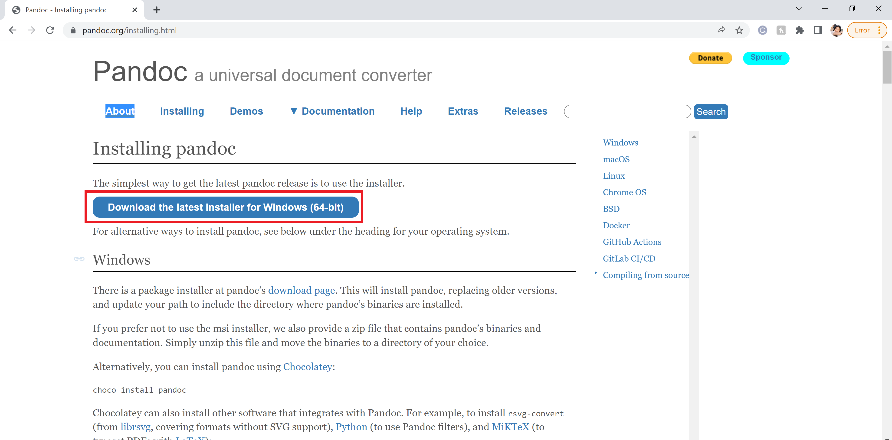
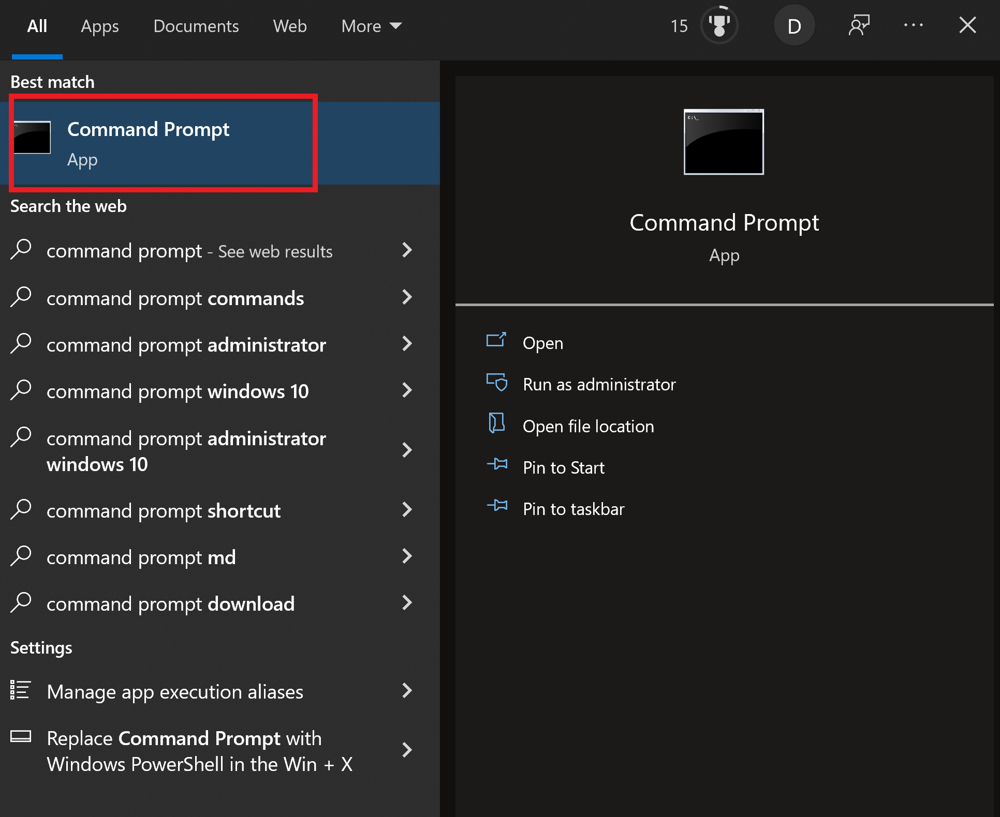
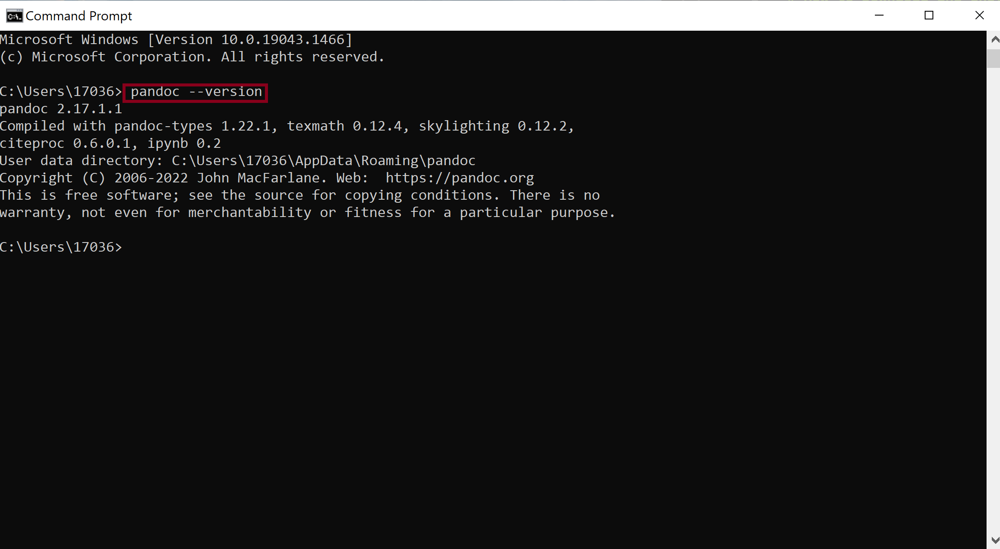

# How to Download and Install Pandoc 
## This section of the guide will teach you how to download and install Pandoc onto your laptop or computer.

# Tools and Requirements
- Preferred web browser 
    > **NOTE:** Google Chrome will be used in this guide.
- Computer or laptop with a functioning operating system (such as Windows or macOS)
    > **NOTE:** Microsoft Windows will be used in this guide. 

# Steps 
### Before you start the process of converting your Word document into a Markdown file, you first need to install Pandoc onto your laptop or computer!

1. **Open** your web browswer.

2. **Type** [pandoc.org/installing.html](pandoc.org/installing.html) into the address bar. 

3. **Click** the blue "Download the latest installer for Windows (64-bit) button under the "Installing pandoc" section (Refer to Figure 1).

    > **NOTE:** Download the correct installer according to your operating system. 

    

  *Figure 1: The Pandoc install page. The blue button is also shown here.*

4. **Verify** that Pandoc has been successfully installed onto your computer or laptop. **Type** "Command Prompt" in the search bar next to the Windows icon on the bottom of your screen. 
  
    >  **NOTE:** This step will be different depending on your operating system. This is called the "Terminal" in macOS. 

5. **Click** the "Command Prompt" app to open the Command Prompt window (Refer to Figure 2). 

    

  *Figure 2: The Command Prompt app.*

6. Once the Command Prompt is open, you should see a blinking cursor. **Type** the following text where the blinking cursor is.
  
  ```sh
    > pandoc \-\-version
  ```

7. **Press** enter. You should see a message telling you which version of Pandoc has been installed and other information (Refer to Figure 3). 

    
  
  *Figure 3: The text that you must type to verify that Pandoc has successfully been installed. The Pandoc version message is also shown here.*

_________

Back to [main page](index.md)
