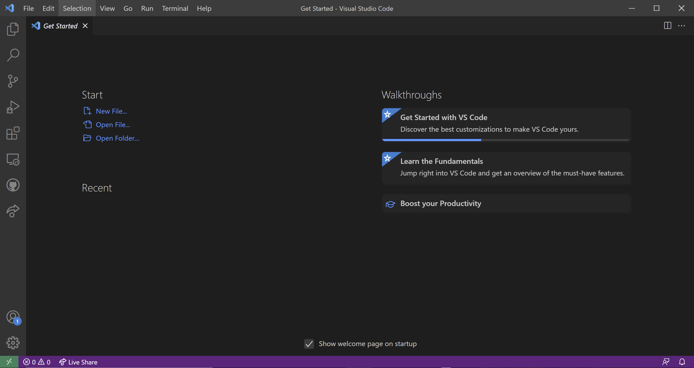

# How to Set Up a Writing and Publishing Environment

Once you have Pandoc installed, you may now begin setting up your working enivronment. Going into this, you should know how to navigate your file explorer and create files.

## Tools

* Visual Studio Code (VS Code, see Figure 4)
  

    *(Figure 4)*

## Steps

1. **Open** your file explorer
2. **Navigate** to the folder you want to work in
3. **Create** a new folder for your project files.

    > NOTE: You might have already created this type of folder. If so, you do not need to create a new one.
4. **Open** VS Code
5. **Open** your project folder in VS Code

    <ol type = "a">
    <li>Click <code>File</code></li>
    <li>Click <code>Open Folder...</code></li>
    <li>Navigate to your project folder</li>
    <li>Select your folder</li>
    <li>Click <code>Select Folder</code></li>
    </ol>
6. **Right-click** the "Explorer" section on the left side of the window (see the square on Figure 5)
7. **Click** `New File` (see the circle on Figure 5)

    
        *(Figure 5)*
8. **Name** your new Markdown file

    > NOTE: The naming convention is usually follows this format -> "relevant-lowercase-file-name-without-spaces.md"
9. **Start** working on your Markdown file.

You have now set up your writing/publishing environment! **DON'T FORGET** to save your progress as you work.

_________

Back to [main page](index.md)
